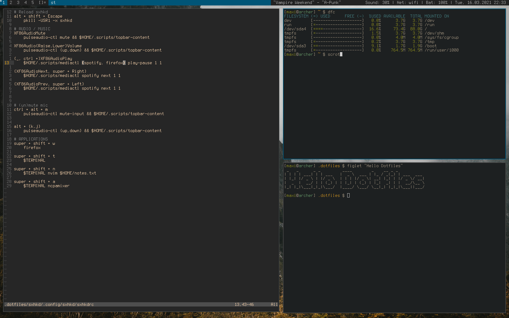

# Dotfiles

> These are my dotfiles for my Arch Linux with dwm installation. Many of these are only working in that environment. But repository can be used as reference for other dotfiles.



Dotfiles can be setup with gnu `stow /*`.

Config files for st and dwm are provided but maybe some patches have to be applied...

```
# Spawning stuff
Super + p                           dmenu
Super + {Return,t}                  terminal
Super + w                           firefox
Super + n                           notes.txt
super + a                           audio mixer

# Window manager
Alt + B                             toggle bar
Alt + {j,k,Tab}                     move focus
Alt + {h,l}                         make master {smaller,larger}
Alt + Return                        window to master
Alt + q                             kill window
Alt + {t,m,f}                       set {tiled,monocle,floating} layout
Alt + Space                         toggle window floating
Alt + {1,2,3,4,5}                   show {n}-th tag
Alt + 0                             show all tags
Alt + Shift + {1,2,3,4,5}           move window to {n}-th tag
Alt + Shift + 0                     move window to all tags
Alt + {Comma,Period}                move monitor focus
Alt + Shift + q                     restart dwm
Alt + {Plus,Minus}                  set gap size
Alt + Ctrl + {1,2,3,4,5}            add tag to view
Alt + Ctrl + Shift + {1,2,3,4,5}    toggle current window on tag


LeftMouse(layoutsymbol)             toggle tiled,monocle layout
LeftMouse(tagbar)                   show exclusively this tag
RightMouse(tagbar)                  add tag to shown tags

LeftMouse(window) + Alt             move window (and set to floating)
RightMouse(window) + Alt            change window size (and set to floating)
MiddleMouse(window) + Alt           toggle window floating
LeftMouse(window) + Alt + Shift     set window to master

LeftMouse(tagbar) + Alt             move focused window exclusively to tag
RightMouse(tagbar) + Alt            add focused window to tag

# Media control (default media keys also work)
MediaPlay                           play / pause spotify
MediaPlay + Ctrl                    play / pause firefox
Super + Ctrl + Right                next spotify song
Super + Ctrl + Left                 prev spotify song
Super + Ctrl + {j,k}                volume {down,up}
Super + Ctrl + p                    play / pause spotify
Super + Ctrl + m                    toggle microphone mute state
```
